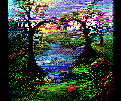

# Here is a comparison of various settings and pictures

source image
 | 
`libpipi`
 | 
`PictOric` aic=0, dither_lvl=0, err_att=0.000
 | 
`PictOric` aic=0, dither_lvl=0, err_att=0.707
 | 
`PictOric` aic=0, dither_lvl=0, err_att=0.998
 | 
`PictOric` aic=0, dither_lvl=2, err_att=0.000
 | 
`PictOric` aic=0, dither_lvl=2, err_att=0.707
 | 
`PictOric` aic=0, dither_lvl=2, err_att=0.998
 | 
`PictOric` aic=0, dither_lvl=-3, err_att=0.000
 | 
`PictOric` aic=0, dither_lvl=-3, err_att=0.707
 | 
`PictOric` aic=0, dither_lvl=-3, err_att=0.998
 | 
`PictOric` aic=1, dither_lvl=0, err_att=0.000
 | 
`PictOric` aic=1, dither_lvl=0, err_att=0.707
 | 
`PictOric` aic=1, dither_lvl=0, err_att=0.998
 | 
`PictOric` aic=1, dither_lvl=2, err_att=0.000
 | 
`PictOric` aic=1, dither_lvl=2, err_att=0.707
 | 
`PictOric` aic=1, dither_lvl=2, err_att=0.998
 | 
`PictOric` aic=1, dither_lvl=-3, err_att=0.000
 | 
`PictOric` aic=1, dither_lvl=-3, err_att=0.707
 | 
`PictOric` aic=1, dither_lvl=-3, err_att=0.998

--|--|--|--|--|--|--|--|--|--|--|--|--|--|--|--|--|--|--|--
 |  |  |  |  |  |  |  |  |  |  |  |  |  |  |  |  |  |  | 
(Click to get the TAP file.)
